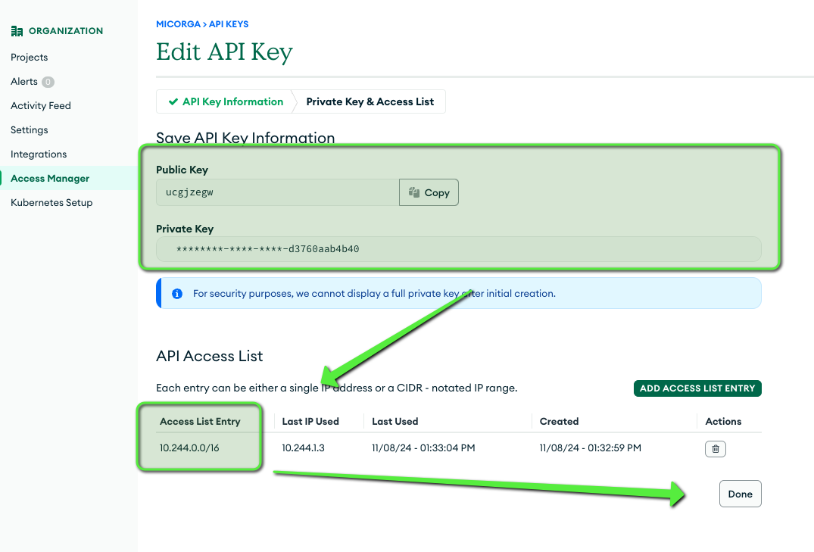
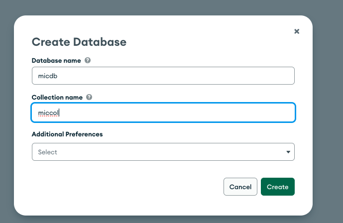
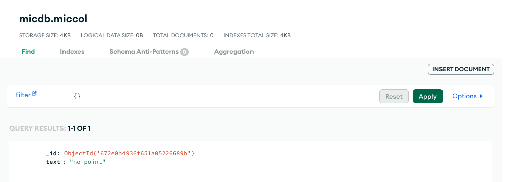
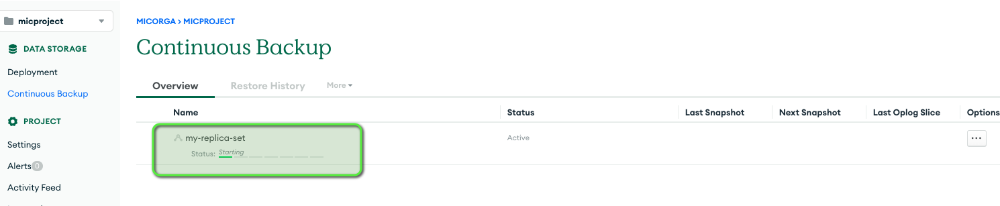
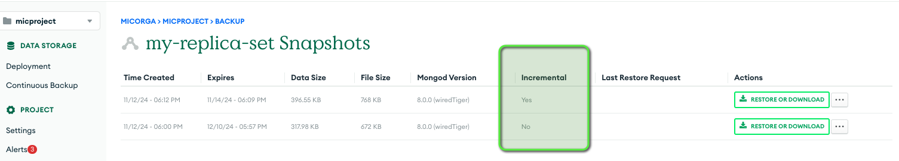
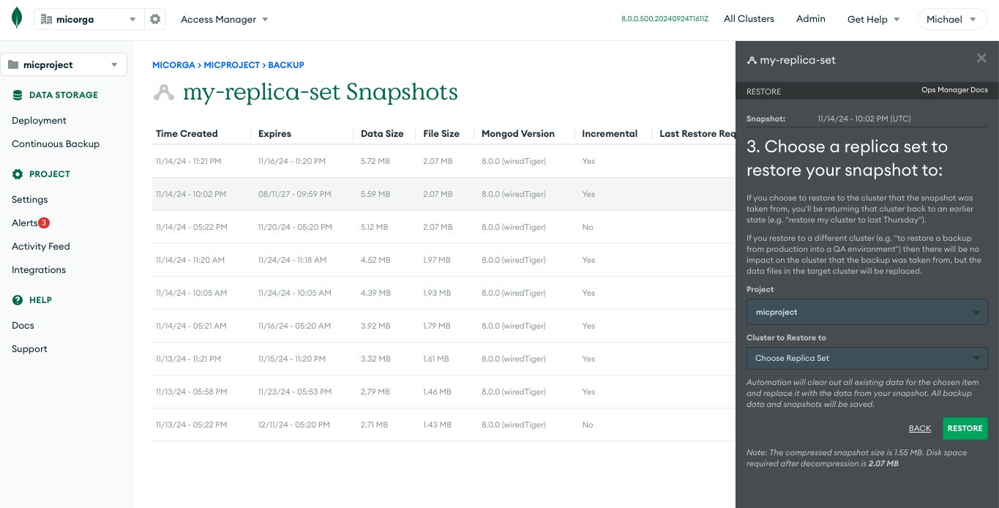

# Goal 

Drive ops-manager from a blueprint to trigger on demand mongodb snapshots. 

# Architecture 

MongoDB Ops Manager, or its cloud-based counterpart, Cloud Manager, is a required component for any 
Enterprise MongoDB deployment. Ops Manager automates, monitors, and performs backups of MongoDB databases. 
The MongoDB Ops Manager consists of:
- The Ops Manager Application, which is the main Ops Manager component and the front-end UI application.
- The Application Database, which is the backing MongoDB database for Ops Manager.
- The Backup Daemon, which is the component supporting the Ops Manager Application in backup and restore 
processes.

https://github.com/mongodb/mongodb-enterprise-kubernetes/blob/master/samples/ops-manager/ops-manager-backup.yaml

## Sizing 

This blueprint has been tested on a 5 nodes AKS cluster "Standard_DS3_v2" (4vcpu and 14G memory each).
```
kubectl version
Client Version: v1.30.3
Kustomize Version: v5.0.4-0.20230601165947-6ce0bf390ce3
Server Version: v1.29.9
```
Per component 
- We had to give 7G of memory to opsmanager otherwise it crashed when we launched a backup.
- The ops-manager database requested by default 500M and we never had to change it 
- The example replica-set was given 2Gb and 2CPU for each member


# install the operator

Let's install the mongodb enterprise operator 
```
kubectl create ns mongodb
helm repo add mongodb https://mongodb.github.io/helm-charts
kubectl apply -f https://raw.githubusercontent.com/mongodb/mongodb-enterprise-kubernetes/master/crds.yaml
helm install enterprise-operator mongodb/enterprise-operator --version 1.28.0 -n mongodb
```


# install opsmanager 

In the opsmanager configuration I defined an s3 op-store and a s3 snapshot-store on AWS. Edit the file according to your storage options.

Notice that the documentation [state](https://www.mongodb.com/docs/ops-manager/v7.0/tutorial/manage-s3-blockstore-storage/#requires-a-dedicated-bucket) that the bucket must be dedicated to the backup (no subpath) and no versionning is supported.

First create the secret for the credentials to the S3 buckets.
```
# create the secret to access s3
AWS_S3_ACCESS_KEY_ID=<xxxxxxxx>
AWS_S3_SECRET_ACCESS_KEY=<yyyyyyy>
cat<<EOF |kubectl create -f - 
apiVersion: v1
kind: Secret
metadata:
  name: my-aws-creds
  namespace: mongodb
type: Opaque
stringData:
  accessKey: ${AWS_S3_ACCESS_KEY_ID}
  secretKey: ${AWS_S3_SECRET_ACCESS_KEY}
EOF

# create the credentials for accessing ops-manager 
kubectl create secret generic ops-manager-admin-secret  \
   --from-literal=Username="user.name@example.com" \
   --from-literal=Password="Passw0rd."  \
   --from-literal=FirstName="Michael" \
   --from-literal=LastName="Courcy" -n mongodb

# create ops manager it will create the opsmanager app, its app replica-set database and a backup daemon
kubectl apply  -n mongodb -f ops-manager.yaml
```

Check ops manager is running, it takes around 7 minutes to fully deploy. 
```
kubectl get opsmanagers.mongodb.com -n mongodb
```

You should get this output 

```
NAME          REPLICAS   VERSION   STATE (OPSMANAGER)   STATE (APPDB)   STATE (BACKUP)   AGE     WARNINGS
ops-manager   1          8.0.0     Running              Running         Running          5h30m   
```

Which means that opsmanager, the app db and the backup daemon are in a running state.

Access opsmanager

Run 
```
kubectl  port-forward service/ops-manager-svc 8080:8080
```

And access http://localhost:8080 with the password and usernames provided in secret `ops-manager-admin-secret`.
Complete the installation process and check in the GUI in the  the backup section the snapshot storage.


You should retreive your configuration. Check also the S3 oplog storage configuration.


# Create an organization and an api key 

## Create an organization 
Go in th opsmanager UI and create an organisation 


Retreive the organization id in my case this is `673394beb1dd0477fca56d98`


## Create an api key 

Create an api key 


Choose organization project creator. If you don't choose this level of authorization it does not work. 
But that [seems expected](https://www.mongodb.com/docs/kubernetes-operator/v1.28/tutorial/create-operator-credentials/#prerequisites).


Choose an IP list by running 
```
kubectl cluster-info dump | jq | grep cluster-cidr
``` 
Or if you're on aks like me 
```
az aks show --resource-group <myResourceGroup> --name <myAKSCluster> --query "networkProfile.podCidr" --output tsv
```


In my case this is `eixonwke/e2fa30dd-2ea5-40b1-a23b-42a76bff2c62` we'll use them later.


## Create config map and credential for the future mongodb to join the project 

Create a configmap that describe the project our future mongodb will join 
```
cat<<EOF | kubectl create -n mongodb -f -
apiVersion: v1
kind: ConfigMap
metadata:
  name: my-project
  namespace: mongodb
data:
  projectName: micproject # this is an optional parameter, if empty we take the name of the resource
  orgId:  673394beb1dd0477fca56d98 # this is an optional parameter
  baseUrl: http://ops-manager-svc.mongodb.svc.cluster.local:8080
EOF
```

Create the credentials 
```
kubectl -n mongodb create secret generic my-credentials --from-literal="user=eixonwke" --from-literal="publicApiKey=e2fa30dd-2ea5-40b1-a23b-42a76bff2c62"
```

Now create the replicaset 
```
cat<<EOF | kubectl create -n mongodb -f -
---
apiVersion: mongodb.com/v1
kind: MongoDB
metadata:
  name: my-replica-set
spec:
  members: 3
  version: 8.0.0-ent
  type: ReplicaSet
  backup:
    mode: enabled
  opsManager:
    configMapRef:
      name: my-project
  credentials: my-credentials

  persistent: true

  podSpec:
    # 'podTemplate' allows to set custom fields in PodTemplateSpec.
    # (https://kubernetes.io/docs/reference/generated/kubernetes-api/v1.17/#podtemplatespec-v1-core)
    # for the Database StatefulSet.
    podTemplate:
      spec:
        containers:
          - name: mongodb-enterprise-database
            resources:
              limits:
                cpu: "2"
                memory: 2G
              requests:
                cpu: "2"
                memory: 2G
EOF
```

the choice `8.0.0-ent` instead of `8.0.0` is necessary to enable backup. 

## Check in ops-manager UI that you see the cluster 

In the project micproject you should see the my-replica-set deployment 


Showing the 3 instances in the server tabs


## Create some data 

Add a database 



And insert some data 


# check the first backup

Once the replica set is ready and because we enabled backup a first backup will be created.

Go to continuous backup and check your backup is starting 


You need to be a bit patient and soon you'll see your first snapshot 

Also the snapshot bucket should have backup elements.


# Create an on demand backup 

We're going to create a new backup on Demand in the GUI 


Check the backup timeline in the Admin UI 


When the on demand backup is over you can see the new backup is an incremental backup 


# The Kasten blueprint 

What you see in the section "Create an on demand backup" is what the Kasten blueprint will do through api call.

## build a kanister-tools image that contains `jq`

`jq` is very useful when managing json content in bash script, unfortunately the base kanister-tools image does not contain this utility. 

Build your kanister-tools image and push it to your respository as I do in this example
```
docker build --platform linux/amd64 . -t michaelcourcy/kanister-tools:0.112.0
docker push michaelcourcy/kanister-tools:0.112.0
```

This image is the one I use in the blueprint, if you build your own do not forget to update the bluprint accordingly.

## Understand what the blueprint is doing  

For people that are not used to blueprint it's always good to see how we can do this within a script.
The kasten blueprint and blueprint binding will integrate all those operations in a single backup workflow.
But by reading the script you get an idea of the workflow.  

```
# set contex on mongodb namespace
kubectl config set-context --current --namespace=mongodb

# this part can be obtained from the mongoDB object 
# obtain the secret for the api key 
apiSecret=$(kubectl get mongodb my-replica-set -ojsonpath='{.spec.credentials}')
# obtain publicKey and privateKey from apiSecret 
publicKey=$(kubectl get secret $apiSecret -o jsonpath='{.data.user}'|base64 -d)
privateKey=$(kubectl get secret $apiSecret -o jsonpath='{.data.publicApiKey}'|base64 -d)
# obtain the base url and the project id
link=$(kubectl get mongodb my-replica-set -ojsonpath='{.status.link}')
baseUrl=$(echo "$link" | awk -F'/v2/' '{print $1}')
projectId=$(echo "$link" | awk -F'/v2/' '{print $2}')

# now we need to operate api call for the rest or the operations
kubectl run --image michaelcourcy/kanister-tools:0.112.0 kanister-tools \
  --env publicKey=$publicKey \
  --env privateKey=$privateKey \
  --env baseUrl=$baseUrl \
  --env projectId=$projectId

# enter the pod
kubectl exec -it kanister-tools -- bash

echo "obtain the clusterId. There is only one cluster per project when using kubernetes operator, we take no risk in taking the first element in the array"
clusterId=$(curl --user "$publicKey:$privateKey" --digest \
     --header "Accept: application/json" \
     --request GET "$baseUrl/api/public/v1.0/groups/$projectId/clusters" |jq -r ".results[0].id")
echo "create on demand snapshot and record the timestamp of the request, retention is long (1000 days) because we'll give to kasten the responsability to delete this snapshot" 
snapshotRequestTimestamp=$(curl --user "$publicKey:$privateKey" \
    --digest  \
    --header "Accept: application/json" \
    --request POST $baseUrl/api/public/v1.0/groups/$projectId/clusters/$clusterId/snapshots/onDemandSnapshot?retentionDays=1000|jq -r ".timestamp.time")

echo "we wait for a snapshot to be complete and created after the snapshotRequestTimestamp"
tmeout=300
wait=0
sleepIncrement=3
timeout=$((timeout+sleepIncrement))
while true; 
do 
  response=$(curl --user "$publicKey:$privateKey" --digest \
     --header "Accept: application/json" \
     --request GET $baseUrl/api/public/v1.0/groups/$projectId/clusters/$clusterId/snapshots)
  snap=$(echo "$response" | jq --arg ts "$snapshotRequestTimestamp" '.results[] | select(.created.time > ($ts | tonumber) and .complete == true) | length')
  if [ -z "$snap" ]
  then
    echo "snapshot not ready yet "
    wait=$((wait+sleepIncrement))
    if [ "$wait" -gt "$timeout" ]
    then 
      echo "timeout $timeout has been reached"
      echo "showing the list of snapshots already listed in $baseUrl/api/public/v1.0/groups/$projectId/clusters/$clusterId/snapshots"
      echo $response | jq
      exit 1
    else
      echo "waiting $((timeout-wait)) seconds"
    fi
    sleep $sleepIncrement
  else
    echo "snapshot ready"
    snapshotId=$(echo "$response" | jq -r --arg ts "$snapshotRequestTimestamp" '.results[] | select(.created.time > ($ts | tonumber) and .complete == true) | .id')
    echo "snapshot id $snapshotId"
    break
  fi
done
```
## Delete the snapshot 

You must have the Global Backup Admin or Global Owner role to delete a snapshot that is within Point-in-Time restore window.

```
publicKey="yynatncr"
privateKey="e1d3c4e1-ef4f-4dad-8c6e-5918e9346325"
curl --user "$publicKey:$privateKey" --digest \
     --header "Accept: application/json" \
     --request DELETE $baseUrl/api/public/v1.0/groups/$projectId/clusters/$clusterId/snapshots/$snapshotId
```

# Install the blueprint 

The blueprint and the blueprintbinding will intergrate the above.

## Prerequisite 

We suppose that [kasten has been installed](https://docs.kasten.io/latest/install/index.html) in the kasten-io namespace.

## Create a global backup api key and put it in a secret 

For simplicity we're going to create a global backup admin api key 

Don't forget to add the ip access list with the pod cidr for the global key 


Create the backup admin secret with your values 
```
kubectl -n kasten-io create secret generic mongodb-backup-admin --from-literal="user=yynatncr" --from-literal="publicApiKey=e1d3c4e1-ef4f-4dad-8c6e-5918e9346325"
```

## Install the blueprint and the blueprintbinding 

```
kubectl create -f mongodb-ent-bp.yaml -n kasten-io 
kubectl create -f mongodb-ent-bp-binding.yaml -n kasten-io 
```

If you navigate to the mongodb application in kasten you can see the blueprint is bound to the MongoDB custom resource


## Create a Kasten policy for the mongodb namespace  

Create a Kasten policy for the mongodb namespace and execute it


Notice that I exclude all the PVCs because in this namespace there is just the PVC of the mongodb cluster and we don't backup them by backing up the PVC.

## Check the restore point 

This policy create a restore point where you can view the mongodb snapshot in the kanister card (one card per mongodb resource)


Check also in the ops-manager UI that the snapshot has been created.


## Delete the restore point 

Delete the restore point 


## Restore 

The restore action is not implemented in this blueprint, because restore operations often need more granularity and waiting for availability.
Practically this is not an issue because restoring is alway an exceptional event.

We recommand using the ops-manager UI


If you need support to implement restore action in the blueprint please contact your commercial representative.


# Link and credits 

A list of link I found useful for building this integration, thanks a lot to [@chris](https://www.mongodb.com/community/forums/u/chris/summary) for 
[his help](https://www.mongodb.com/community/forums/t/api-for-on-demand-snapshots/304187) on onDemand snapshot API that were not yet documented.

The 4 api we use in the blueprint
- [Discover the cluster Id](https://www.mongodb.com/docs/ops-manager/current/reference/api/clusters/clusters-get-all/)
- [Create on demand snapshot](https://www.mongodb.com/community/forums/t/api-for-on-demand-snapshots/304187) (not yet documented)
- [Check a snapshot is complete](https://www.mongodb.com/docs/ops-manager/current/reference/api/snapshots/get-all-snapshots-for-one-cluster/) 
- [Delete a snapshot](https://www.mongodb.com/docs/ops-manager/current/reference/api/snapshots/remove-one-snapshot-from-one-cluster/) 

Other links 
- https://www.mongodb.com/try/download/enterprise-kubernetes-operator
- https://github.com/mongodb/mongodb-enterprise-kubernetes
- https://www.mongodb.com/docs/ops-manager/current/reference/glossary/#std-term-Ops-Manager-Application
- https://www.mongodb.com/docs/ops-manager/current/tutorial/configure-public-api-access/#programmatic-api-keys
- https://www.mongodb.com/docs/ops-manager/current/tutorial/manage-programmatic-api-keys/
- https://www.mongodb.com/docs/kubernetes-operator/current/tutorial/deploy-om-container/#std-label-deploy-om-container
- https://www.mongodb.com/docs/kubernetes-operator/current/tutorial/deploy-om-container/#std-label-deploy-om-container
- https://www.mongodb.com/docs/kubernetes-operator/current/tutorial/plan-om-resource/#std-label-om-rsrc-prereqs
- https://www.mongodb.com/docs/kubernetes-operator/current/tutorial/plan-k8s-op-compatibility/#std-label-k8s-mdb-version-compatibility
- https://www.mongodb.com/docs/ops-manager/v7.0/tutorial/manage-s3-blockstore-storage/
- https://www.mongodb.com/docs/ops-manager/v7.0/tutorial/prepare-backing-mongodb-instances/
- https://www.mongodb.com/docs/kubernetes-operator/v1.28/tutorial/back-up-mdb-resources/
- https://www.mongodb.com/docs/ops-manager/current/api/
- https://www.mongodb.com/docs/cloud-manager/tutorial/manage-programmatic-api-keys/#std-label-mms-prog-api-key
- https://www.mongodb.com/community/forums/c/ops-admin/enterprise/41

